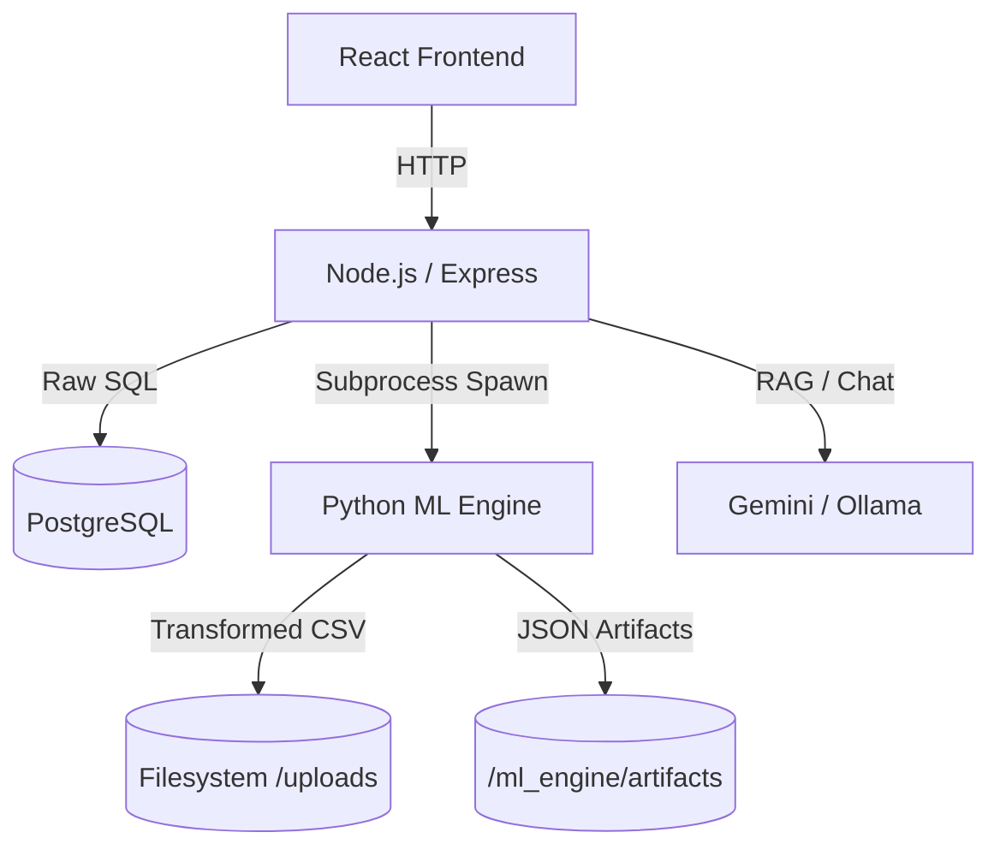

# DataInsights.ai – System Architecture and Technical Documentation

## Table of Contents
1. [Project Overview](#1-project-overview)
2. [System Architecture](#2-system-architecture)
3. [Technology Stack](#3-technology-stack)
4. [File and Folder Structure](#4-file-and-folder-structure)
5. [ML Pipeline Architecture](#5-ml-pipeline-architecture)
6. [Data Processing Workflow](#6-data-processing-workflow)
7. [AI Chat & RAG Engine](#7-ai-chat--rag-engine)
8. [Database Schema](#8-database-schema)
9. [Security and Isolation](#9-security-and-isolation)
10. [Testing and Verification](#10-testing-and-verification)

---

## 1. Project Overview

DataInsights.ai is an intelligent SaaS platform that automates the data analytics lifecycle. It ingests raw tabular datasets and uses a Python-based Machine Learning pipeline to clean, profile, and extract insights, serving them via a dynamic React dashboard and an AI-powered conversational interface.

### Key Capabilities
*   **On-Demand Processing:** Datasets are cleaned and analyzed using dedicated Python processes triggered via the API.
*   **Dynamic Visualization:** Automatic chart recommendation based on data cardinality and types.
*   **Conversational BI:** Ask questions about your data in plain English.

---

## 2. System Architecture

DataInsights.ai uses a decoupled three-tier architecture. Unlike traditional asynchronous workers, it leverages direct process spawning for analytical tasks to ensure immediate feedback and simplicity in development.



### Component Roles
*   **Frontend (React + Vite):** Handles the user interface, data visualization (Recharts), and state management.
*   **Backend API (Node.js + Express):** Orchestrates the workflow, manages authentication, and interfaces with the database and ML engine.
*   **ML Engine (Python):** The computational heart. It performs data cleaning, KPI calculation, and generates visualization metadata.
*   **Database (PostgreSQL):** Stores relational data including users, companies, datasets, and permissions.

---

## 3. Technology Stack

### Frontend
*   **React:** Component-based UI.
*   **Recharts:** Declarative charting.
*   **Axios:** API communication.

### Backend
*   **Node.js & Express:** Scalable API layer.
*   **pg (node-postgres):** Non-blocking PostgreSQL client.
*   **Multer:** Sequential file upload handling.
*   **JWT:** Stateless authentication.

### ML & AI
*   **Python:** core analytical language.
*   **Pandas & NumPy:** Tabular data processing.
*   **Scikit-Learn:** Data cleaning and modeling.
*   **Google Generative AI (Gemini):** Advanced LLM for semantic querying.
*   **Ollama:** Local LLM support for offline or private analysis.

---

## 4. File and Folder Structure

```text
root/
├── uploads/               # Central data storage
│   ├── raw/               # User-uploaded files and working copies
│   └── cleaned/           # Finalized, processed datasets
├── backend-node/          # Express API
│   ├── src/
│   │   ├── controllers/   # Business logic (spawn scripts, DB queries)
│   │   ├── routes/        # API endpoints
│   │   ├── models/        # (Optional) Schema definitions
│   │   └── utils/         # Helpers (access control, path resolution)
├── ml_engine/             # Analytical Core
│   ├── pipeline/          # Modular cleaning and analysis steps
│   ├── artifacts/         # Generated JSON insights per dataset
│   ├── rag_engine.py      # AI Chat logic
│   └── run_pipeline.py    # Main entry point
└── frontend-react/        # React Application
```

---

## 5. ML Pipeline Architecture

The ML Engine follows a strictly defined sequence of modules:

1.  **Validator:** Sanity checks on file integrity and encoding.
2.  **Schema Manager:** Infers types (Numeric, Categorical, Datetime).
3.  **Cleaner:** Imputes missing values and handles outliers.
4.  **Feature Engineer:** Generates additional metrics (e.g., date parts).
5.  **BI Engine & Dashboard:** Determines best chart types and generates Recharts-compatible JSON.
6.  **Metric & Insight Engine:** Calculates KPIs and templates natural language summaries.

---

## 6. Data Processing Workflow

1.  **Upload:** User uploads `raw.csv` to `/api/upload`.
2.  **Storage:** File is saved to `uploads/raw/` with a unique UUID.
3.  **Analysis Trigger:** User clicks "Analyze" in the UI, calling `/api/datasets/:id/transform`.
4.  **Python Execution:** Node.js spawns `python transformer.py` which reads the raw file and writes a `working` version.
5.  **Finalization:** Once cleaning is approved, the file is moved to `uploads/cleaned/` and artifacts (JSON) are generated in `ml_engine/artifacts/:id/`.
6.  **Rendering:** Frontend fetches the artifacts to render the dashboard.

---

## 7. AI Chat & RAG Engine

DataInsights.ai features a hybrid AI interface:
*   **Semantic Mapping:** Uses `RapidFuzz` to map natural language columns to exact dataset headers.
*   **Gemini Integration:** Leverages Google's Gemini for high-level reasoning and data interpretation.
*   **Ollama Support:** Allows running local models (like Llama 3) for data privacy.
*   **RAG:** The engine uses the generated schema and a sample of the data to provide context to the LLM, ensuring accurate answers.

---

## 8. Database Schema

The system uses **PostgreSQL** for persistence. Key tables include:
*   **Users:** Authentication and profile data.
*   **Companies:** Multi-tenant grouping.
*   **Datasets:** Metadata for uploaded files, including the `schema_json` blob for cached insights.
*   **Permissions:** Granular access control mapping users to datasets.
*   **Activity Logs:** Audit trail for all major actions.

---

## 9. Security and Isolation

*   **Filesystem Isolation:** Path resolution is strictly managed via specialized utilities (`accessUtils.js`) to prevent directory traversal.
*   **Access Control:** Every API request validates the user's `role` and `permissions` before allowing file access or processing.
*   **Process Sandboxing:** Python processes are spawned with limited context and timeouts to prevent resource exhaustion.

---

## 10. Testing and Verification

*   **Pytest:** Extensive unit testing for the Python transformation logic.
*   **Jest:** Backend unit tests for API routes and utility functions.
*   **E2E:** Verification of the full flow from upload to chat.
