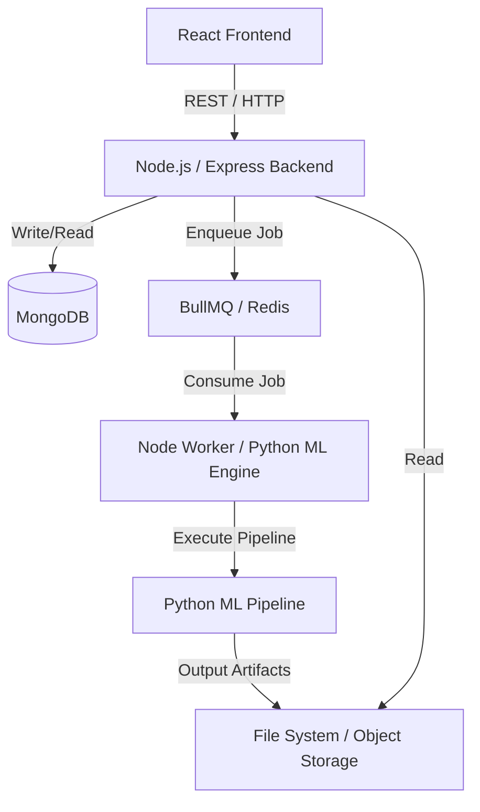

# DataInsights.ai – System Architecture, Workflow, and Technical Documentation

## Table of Contents
1. [Project Overview](#1-project-overview)
2. [Complete System Architecture](#2-complete-system-architecture)
3. [Technology Stack](#3-technology-stack)
4. [Complete File and Folder Structure](#4-complete-file-and-folder-structure)
5. [ML Pipeline Architecture](#5-ml-pipeline-architecture)
6. [Full Data Processing Workflow](#6-full-data-processing-workflow)
7. [Frontend Application Workflow](#7-frontend-application-workflow)
8. [Query Engine Design](#8-query-engine-design)
9. [Dashboard Generation](#9-dashboard-generation)
10. [Multi-Tenant Architecture](#10-multi-tenant-architecture)
11. [Performance Optimizations](#11-performance-optimizations)
12. [System Logging and Monitoring](#12-system-logging-and-monitoring)
13. [Security Model](#13-security-model)
14. [Deployment Architecture](#14-deployment-architecture)
15. [Testing and Verification](#15-testing-and-verification)
16. [Current Known Issues and Improvements](#16-current-known-issues-and-improvements)
17. [Real-World Use Cases](#17-real-world-use-cases)
18. [Final Technical Summary](#18-final-technical-summary)

---

## 1. Project Overview

### Purpose
DataInsights.ai is an intelligent, multi-tenant SaaS platform that automates the entire end-to-end data analytics lifecycle. It ingests raw tabular datasets and uses a sophisticated Machine Learning pipeline to automatically clean, profile, and extract actionable insights, ultimately serving dynamic dashboards and providing an AI-powered conversational interface for ad-hoc querying.

### Problem the Product Solves
Traditional data analytics requires data scientists and analysts to manually clean data, select models, and design dashboards. This creates a severe bottleneck for fast-moving businesses. DataInsights.ai eliminates this friction by providing a "zero-setup" automated analytics pipeline that instantly turns raw CSV files into interactive BI dashboards and queryable knowledge bases.

### Target Users
* **Business Analysts** who need quick automated EDA (Exploratory Data Analysis).
* **Product Managers and Executives** who want high-level metric summaries without waiting for data engineering teams.
* **Data Scientists** seeking a rapid baseline generation tool for cleaning and feature engineering.
* **Non-technical Stakeholders** who want to ask plain-English questions about their data.

### Key Capabilities
* **Automated Data Analysis:** Automatic schema inference, missing value imputation, and advanced feature engineering.
* **Automated Insights:** Uncovers correlations, trends, forecasts, and statistical anomalies without human intervention.
* **Dynamic Dashboards:** Generates multi-chart React dashboards on the fly based on the specific shape and content of the uploaded dataset.
* **AI Assistant (Query Engine):** Allows plain-text queries mapped directly to Pandas operations using intent detection, removing the reliance on expensive LLM API calls.

### How the Platform Converts Raw Datasets into Business Insights
1. **Ingestion:** Users upload a raw CSV.
2. **Standardization:** The ML engine cleans and structures the dataset.
3. **Extraction:** It calculating KPIs, running predictive models (like Prophet/XGBoost), and identifying key drivers.
4. **Serialization:** Insights are saved as highly structured JSON artifacts.
5. **Presentation:** The React frontend maps these JSON artifacts to beautiful charts and a chat interface.

---

## 2. Complete System Architecture

### High-Level Architecture
DataInsights.ai relies on a robust, decoupled three-tier architecture that clearly separates the user interface, the API gateway/orchestration layer, and the intensive mathematical processing layer. 



### Component Interaction
* **Frontend (React + Vite):** Serves the Single Page Application, handling uploads, charting, and polling status endpoints.
* **Backend API (Node.js + Express):** Acts as the central nervous system. It handles user authentication, file uploads, interacts with MongoDB to store dataset metadata, and pushes processing jobs to Redis.
* **Queue System (BullMQ + Redis):** Ensures reliable, asynchronous processing of datasets. The Node.js worker pulls jobs from BullMQ and securely spawns the heavy Python ML pipeline.
* **ML Engine (Python):** The computational core. Runs in an isolated process stringing together cleaning, profiling, and modeling tasks.
* **Database (MongoDB):** Stores multi-tenant state—users, datasets, file locations, job statuses, and metadata.

### Data Flow & Asynchronous Processing
1. The Frontend posts a multipart form to the Node backend.
2. Node saves the file temporarily and records the dataset in MongoDB with status `processing`.
3. Node enqueues a `process-dataset` job in BullMQ and immediately returns a `202 Accepted` to the Frontend.
4. The Frontend begins periodically polling the `GET /api/dataset-status` route.
5. A background BullMQ Worker picks up the job and executes the Python ML entry point via `child_process.spawn`.
6. Python processes the file, generating various JSON artifacts into a secure, tenant-scoped directory.
7. Upon successful exit (status 0), the worker updates MongoDB to `completed`.
8. The Frontend polling detects `completed` and redirects the user to the Dashboard view, which fetches the JSON artifacts via the Node API.

---

## 3. Technology Stack

### Frontend
* **React:** powers the component-based, declarative UI.
* **Vite:** provides instantaneous HMR (Hot Module Replacement) and highly optimized production builds.
* **React Router:** manages client-side routing between Workspaces, Uploads, Dashboards, and Chat views.
* **Axios:** handles HTTP communication with the Node.js API.
* **Recharts:** chosen for its composable, declarative charting layout, seamlessly converting ML JSON outputs into SVG visualizations.

### Backend
* **Node.js & Express:** Provide a lightweight, highly concurrent, non-blocking I/O API layer.
* **Multer:** Handles multipart/form-data for robust file uploads.
* **JWT Authentication:** Ensures stateless, scalable API security across the platform.
* **BullMQ & Redis:** Chosen for robust asynchronous job pacing, retry logic, and preventing the Node event loop from blocking during hefty ML tasks.

### ML Pipeline
* **Python:** The undisputed industry standard for data science.
* **Pandas & NumPy:** Core tabular data manipulation and high-performance vectorized operations.
* **Scikit-Learn:** Provides baseline models, scalers, imputers, and feature importance algorithms.
* **XGBoost:** Used for advanced non-linear regression and classification profiling.
* **Statsmodels & Prophet:** Provide reliable time-series forecasting.
* **RapidFuzz:** Enables rapid string metric calculation (fuzzy matching), crucial for mapping plain-text user queries to exact dataset column names.
* **Plotly:** Employed for generating sophisticated offline HTML graphs or JSON layouts when Recharts isn't sufficient.

### Database
* **MongoDB:** A NoSQL approach provides the flexibility needed to store rapidly changing, unstructured metadata regarding varying datasets without cumbersome schema migrations.

---

## 4. Complete File and Folder Structure

A standardized, decoupled repository structure ensuring clean separation of concerns:

```text
root/
│
├ frontend-react/
│ ├ src/
│ │ ├ components/    # Reusable UI elements (Buttons, Cards, Modals)
│ │ ├ pages/         # Top-level route components (Dashboard, Upload, Chat)
│ │ ├ services/      # API client wrappers (Axios instances)
│ │ ├ context/       # React Context providers (AuthContext)
│ │ └ routing/       # React Router setup
│
├ backend-node/
│ ├ src/
│ │ ├ controllers/   # Route handlers (Upload, Status, Query)
│ │ ├ routes/        # Express route definitions
│ │ ├ models/        # Mongoose schema definitions
│ │ ├ middleware/    # Auth, Multer, Error handlers
│ │ └ queue/         # BullMQ queue configurations and worker definitions
│
├ ml_engine/
│ ├ pipeline/        # Core analytical modules
│ │ ├ validator.py
│ │ ├ clean.py
│ │ ├ forecaster.py
│ │ └ ...
│ ├ utils/           # Helper scripts (JSON encoders, loggers)
│ ├ logs/            # Python execution and system logs
│ └ data/            # Scoped local data storage (Raw + Artifacts)
│   └ users/         # Multi-tenant data segregation
│
├ docker-compose.yml # Orchestration configuration
└ README.md
```

### Roles of Key Directories
* **`frontend-react/src/pages/`**: Holds the main application views. Keeps routing logic clean mapping 1:1 with URLs.
* **`backend-node/src/queue/`**: Isolates the asynchronous processing logic away from the fast API response layer.
* **`ml_engine/pipeline/`**: The heart of the application; a modular sequence of steps that run sequentially.
* **`ml_engine/data/users/`**: Crucial for security; strictly segregates tenant data by User ID and Dataset ID.

---

## 5. ML Pipeline Architecture

The ML Engine follows a strictly defined "Chain of Responsibility" pattern. A central controller pushes data sequentially through specialized modules.

### Pipeline Modules Detailed

#### `validator.py`
* **Input:** Raw user-uploaded CSV.
* **Processing:** Checks file encoding, basic structural integrity, and ensures minimum row/column thresholds are met.
* **Output:** Cleaned bytes buffer or raw dataframe.
* **Role:** Security and basic sanity checking before expensive operations begin.

#### `schema_manager.py`
* **Input:** Raw Dataframe.
* **Processing:** Infers data types (Categorical, Numeric, Datetime, Boolean). Detects PII or noisy IDs to exclude.
* **Output:** `schema.json`
* **Role:** Establishes the rules of engagement. Subsequent modules use this schema to know how to handle specific columns.

#### `cleaner.py`
* **Input:** Dataframe & Schema.
* **Processing:** Imputes missing values (mean/median for numeric, mode for categorical), removes duplicate rows, handles extreme outliers using IQR boundaries.
* **Output:** Cleaned Dataframe.
* **Role:** Providing a mathematically sound baseline dataset for models to run on.

#### `feature_engineer.py`
* **Input:** Cleaned Dataframe.
* **Processing:** Extracts features (e.g., month/day from datetime), encodes categoricals, standardizes skew.
* **Output:** Augmented Dataframe.
* **Role:** Increasing the predictive power of the dataset.

#### `trainer.py`
* **Input:** Augmented Dataframe.
* **Processing:** Runs isolated XGBoost/RandomForest models on target variables to calculate permutation importances.
* **Output:** `feature_importance.json`
* **Role:** Identifying the "key drivers" of key metrics (e.g., what drives Revenue).

#### `forecaster.py`
* **Input:** Cleaned Dataframe.
* **Processing:** If a primary datetime column is detected, it runs a Prophet or ARIMA model on numeric targets.
* **Output:** `forecast.json`
* **Role:** Projecting metrics into the future.

#### `bi_engine.py` & `dashboard.py`
* **Input:** Cleaned Dataframe & Schema.
* **Processing:** Determines the best chart representations based on cardinality and types.
* **Output:** `dashboard_config.json`
* **Role:** Translating data into a layout understandable by React Recharts.

#### `insight_engine.py` & `metric_engine.py`
* **Input:** All prior artifacts.
* **Processing:** Synthesizes metrics, calculates variance, and templates natural language insights.
* **Output:** `metrics_definition.json`, `kpi_summary.json`, `insights.json`
* **Role:** Creating the human-readable text and bold KPI numbers seen at the top of the dashboard.

#### `query_engine.py`
* **Input:** User text query & Dataset context.
* **Processing:** Maps intent to Pandas operations using fuzzy logic; executed dynamically when called via API.
* **Output:** Exact query result.
* **Role:** Powering the chat assistant.

---

## 6. Full Data Processing Workflow

The lifecycle of a dataset completely unifies the decoupled architecture.

1. **User Upload:** The user selects a dataset in the React app.
2. **`POST /api/upload`:** The React client pushes the file to the Node backend.
3. **Dataset Stored:** The file is securely stored in `/ml_engine/data/users/<userId>/<datasetId>/raw.csv`. A MongoDB document marks the status as `processing`.
4. **BullMQ Enqueue:** The Node controller pushes job metadata to Redis. The request ends here for the user.
5. **Worker Execution:** A worker pulls the job, spawns `python run_pipeline.py --dataset_path <path>`, executing the ML pipeline modules in sequence.
6. **Artifact Generation:** The pipeline yields multiple JSON artifacts (e.g., `schema.json`, `insights.json`) adjacent to the raw file.
7. **Status Update:** The worker writes `completed` back to MongoDB.
8. **Dashboard Created:** Frontend polling sees `completed`, requests GET `/api/dashboard`, which reads the JSON artifacts and renders the BI Dashboard.
9. **Query Engine Enabled:** The chat tab becomes available, leveraging the generated schema to accurately route NLP questions to the Python `query_engine`.

---

## 7. Frontend Application Workflow

### UX Flow
1. **Upload Page:** Main dropzone for CSV files. Initiates the creation flow.
2. **Processing Page:** Displays a generic or specific loading animation while polling occurs.
3. **Dashboard Page:** Renders KPI Cards, Recharts components, and insight summaries.
4. **Chat Assistant Page:** An interactive chat UI for conversational querying against the dataset.
5. **Datasets Workspace:** A grid/list of previously processed datasets allowing users to jump back into past analyses.

### Key API Interactions
* **`POST /api/upload`**: Pushes the multipart form. Returns a `datasetId`.
* **`GET /api/dataset-status/:id`**: React sets a `setInterval` or uses React Query to poll this endpoint every 2 seconds until the status is neither `processing` nor `queued`.
* **`GET /api/dashboard/:id`**: Fetches the structured JSON containing `kpi_summary` and `dashboard_config` to mount the UI.
* **`POST /api/query/:id`**: Sends `{ "question": "What is the total revenue by region?" }`.

### React Polling Mechanism
Using hooks (`useEffect`), the frontend implements a back-off polling strategy to monitor the backend, preventing HTTP timeout errors and providing a smooth UX decoupled from heavy backend computation.

---

## 8. Query Engine Design

A standout feature of DataInsights.ai is its ability to perform Natural Language Processing on tabular data **without relying heavily on expensive, rate-limited external LLMs** for every query.

1. **Intent Detection:** The Python engine evaluates the user's string to categorize the intent: `Aggregation`, `Filtering`, `Trend Analysis`, or `Distribution`.
2. **Keyword Mapping & Schema Matching:** It maps words like "total", "average", "by" to Pandas functions (`sum()`, `mean()`, `groupby()`).
3. **RapidFuzz Column Mapping:** Uses the Levenshtein distance metric via the `RapidFuzz` library to map user terms (e.g., "sales") to exact column names (e.g., "`Sales_Volume_USD`").
4. **Query Templates:** Based on intent, it drops variables into pre-defined Pandas execution templates.
   * *Example Template (Aggregation):* `df.groupby('Mapped_Categorical')['Mapped_Numeric'].sum()`
5. **Execution:** The Pandas operation evaluates rapidly in-memory, returning the formatted string or JSON to the UI.

---

## 9. Dashboard Generation

Dashboards are not hardcoded. They are dynamically generated based on runtime schema analysis represented by `dashboard_config.json`.

### Chart Recommendation Engine
The ML Pipeline evaluates combinations of columns to recommend valid visualizations:
* **Time-Series Analysis:** `Datetime` column + `Numeric` column → Maps to a **Line Chart**. (e.g., Date + Sales).
* **Categorical Comparison:** Low cardinality `Categorical` column + `Numeric` column → Maps to a **Bar Chart** or **Pie Chart**. (e.g., Region + Revenue).
* **Distribution Analysis:** Isolated single `Numeric` column → Maps to a **Histogram / Area Chart**.

### `dashboard_config.json` Mapping
The React frontend loops over the configurations. For instance:
```json
{
  "type": "bar",
  "xAxis": "region",
  "yAxis": "revenue",
  "data": [ { "region": "North", "revenue": 1000 }, ... ]
}
```
React dynamically renders `<BarChart data={config.data}>` parsing axes definitions automatically.

---

## 10. Multi-Tenant Architecture

Security and data isolation are critical for SaaS applications. 

### Data Isolation
All datasets and generated artifacts are strictly isolated on the file system and mapped securely via MongoDB based on the authenticated User's UUID.

**Directory Structure:**
```
ml_engine/data/users/
 └── <user_uuid>/
      ├── <dataset_uuid_1>/
      │    ├── raw.csv
      │    ├── schema.json
      │    └── insights.json
      └── <dataset_uuid_2>/
```

### Security Benefits
* **No Cross-Contamination:** A vulnerability in a Pandas script cannot accidental leak data from `User B` to `User A` because path resolution is strictly bounded by the `user_uuid` embedded in exactly signed JWT tokens.
* **Easy Clean-up:** Deleting a user’s workspace is an instantaneous `rm -rf` on a single folder.

---

## 11. Performance Optimizations

* **Artifact Caching:** The frontend fetches pre-computed JSON files. Dashboards load in milliseconds, regardless of how massive the original dataset was, because computation happens exactly once during the pipeline phase.
* **Asynchronous Job Queues:** BullMQ handles spike loads. If 100 users upload files simultaneously, the Node server won't crash; the queue simply processes them in FIFO order using Redis.
* **Dataset Sampling:** For files exceeding 1 million rows, the ML pipeline can be configured to intelligently sample constraints, maintaining statistical significance while reducing processing time from hours to minutes.
* **Query Caching:** Identical questions asked in the Query Engine hit a Redis cache layer before spawning a Pandas evaluation.

---

## 12. System Logging and Monitoring

A robust application requires high observability.

* **Node.js Lifecycle Logs:** Winston or Morgan is used to track HTTP request timing, HTTP status codes, and user IP mapping.
* **Pipeline Timing Logs:** Each Python module logs exact start/stop execution times to `logs/system.log`. This reveals bottlenecks (e.g., "Imputation took 45 seconds").
* **BullMQ Dashboard:** Provides an interface to trace failed queues, retries, and overall CPU node saturation.
* **Debugging Workflow:** When a dataset fails processing, the `dataset-status` route returns 'failed', and engineers can extract the exact stack trace correlated by dataset ID from `system.log`.

---

## 13. Security Model

* **JWT Authentication:** All API interactions require a valid JSON Web Token passed in the `Authorization` header, validating identity statelessly.
* **User-Scoped Access:** Every MongoDB query and filesystem lookup strictly enforces `{ userId: req.user.id }`.
* **API Rate Limiting:** Prevents abuse of the uploading and querying endpoints using `express-rate-limit`.
* **File Validation:** The `multer` layer and Python `validator.py` ensure uploaded files are exclusively text/csv or valid excell formats, rejecting malicious payloads or executables before they interact with disk.

---

## 14. Deployment Architecture

For scalable production SaaS environments, the architecture relies heavily on containerization.

### Docker Containers
* **`api-node`:** The Express API. Scalable horizontally.
* **`worker-node`:** The background worker running Python. Can be scaled separately based on heavy ML loads.
* **`redis`:** In-memory queue storage.
* **`mongo`:** Dedicated database cluster.

### Container Orchestration
A `docker-compose` setup connects these services via an internal virtual network, completely hiding Redis and MongoDB from the public internet. Only the Node API is mapped externally behind an NGINX reverse proxy providing SSL termination.

---

## 15. Testing and Verification

A comprehensive testing strategy ensures stability for business applications.

* **Unit Tests (Backend):** Jest is configured to test isolated functions like JWT validation and Queue enqueueing mechanisms.
* **Unit Tests (ML Pipeline):** `pytest` handles extensive testing of Pandas algorithms. Mock dataframes are passed to standard modules to assure assertions hold (e.g., running `python -m pytest tests/`).
* **Integration Tests:** Cypress or React Testing Library runs E2E (End-to-End) flows: Logging in → Uploading a mock file → Awaiting completion → Verifying dashboard elements mount.

---

## 16. Current Known Issues and Improvements

* **Pipeline Bottlenecks:** Extremely wide datasets (1,000+ columns) currently slow down the schema inference and feature importance algorithms linearly.
* **Memory Limits:** The Python engine loads datasets wholly into memory (Pandas limitation). Future implementation will migrate to `Polars` or `Dask` to enable out-of-core streaming computations for datasets exceeding server RAM limits.
* **LLM Hookup:** Adding optional integrations to OpenAI or Anthropic API for more complex, non-deterministic query engine generation where exact keyword matching fails.

---

## 17. Real-World Use Cases

Companies spanning industries leverage DataInsights.ai:
* **Retail Sales Analytics:** Uploading POS transactional logs to automatically receive season-over-season revenue breakdowns, identify top-selling products via bar charts, and forecast next week's inventory demands.
* **Marketing Campaign Analysis:** Parsing ad-spend vs. click-through-rate sheets to determine exactly which demographic features drive highest conversion without requiring a data scientist.
* **Financial Forecasting:** Supplying historical ledger exports to receive automated anomaly detection on expense spikes and ARIMA-based burn rate projections.

---

## 18. Final Technical Summary

DataInsights.ai acts as a paradigm shift bridging the gap between raw data and accessible BI. By pairing an asynchronous Node.js microservice architecture with Python’s premier data science capabilities, the product offers enterprise-grade stability, horizontal scalability, and strict tenant security. 

The extensive use of architectural decoupling allows the frontend to be incredibly nimble while protecting the backend from computational exhaustion via robust queue orchestration. This architecture ensures DataInsights.ai is highly capable as a production-ready SaaS product designed to bring automated Data Science to the masses.
