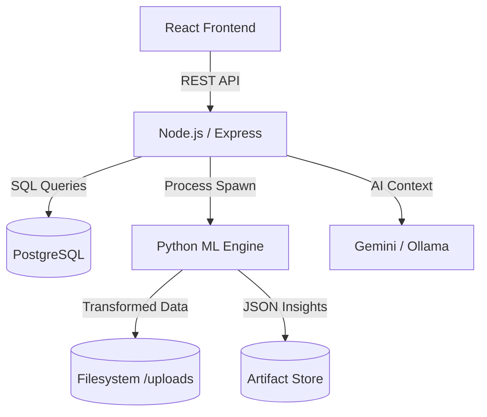

# DataInsights.ai 🚀

[](https://nodejs.org/)
[](https://reactjs.org/)
[](https://www.postgresql.org/)
[](https://www.python.org/)
[](https://deepmind.google/technologies/gemini/)

**DataInsights.ai** is a powerful, automated data analytics platform designed to turn raw tabular data into actionable business insights instantly. By combining a robust Node.js backend with a sophisticated Python ML Engine, it provides a seamless experience for data cleaning, profiling, visualization, and AI-powered conversational analysis.

---

## 🌟 Key Features

### 🛠️ Intelligent Data Pipeline
- **Automated Cleaning**: Precise imputation of missing values, duplicate removal, and advanced outlier detection.
- **Deep Profiling**: Automatic schema inference and data type detection (Numeric, Categorical, Datetime).
- **Artifact Generation**: High-performance JSON artifacts for instant frontend rendering.

### 📊 Visualization & Discovery
- **Interactive Dashboards**: Dynamically generated visualizations powered by React and Recharts.
- **Dataset Discovery**: A glassmorphism-based discovery modal for employees to request access to new datasets.
- **High-Density Monitoring**: Real-time admin dashboard for monitoring platform activity and resolving access requests.

### 🤖 AI-Powered Chat
- **Conversational BI**: Query your datasets in plain English using a hybrid RAG (Retrieval-Augmented Generation) approach.
- **Multi-Model Support**: Integration with Google Gemini for high-level reasoning and Ollama for private, local processing.

---

## 🏗️ System Architecture

The system follows a decoupled three-tier architecture, optimizing for speed and clarity of data flow.



---

## 🚀 Technical Highlights

- **RBAC Security**: Robust Role-Based Access Control ensuring strict data isolation between companies and individual users.
- **Visual Assignment Flow**: Admin resolution system with auto-scroll and pulsing highlight animations for precise dataset assignment.
- **Hybrid Storage Strategy**: High-availability PostgreSQL metadata combined with an optimized filesystem-based blob store for large datasets.

---

## 🛠️ Getting Started

To get the platform running in your local environment, follow these steps:

1.  **Clone the Repository**:
    ```bash
    git clone https://github.com/garvjain7/saasPlatform.git
    cd saasPlatform
    ```

2.  **Refer to the Setup Guide**:
    For detailed environmental configuration and dependency installation, please check:
    👉 **[Setup Guide](./setup.md)**


---

## 📄 Documentation

For a deep dive into the platform's inner workings, please refer to:
*   [Technical Architecture](./DataInsights_Architecture.md)
*   [Database Schema](./database_schema.sql)
*   [Employee Workspace Guide](./frontend-react/src/pages/employee/DatasetAnalysisPage.jsx)


---
Built with ⚡ by the **DataInsights.ai Team**.
